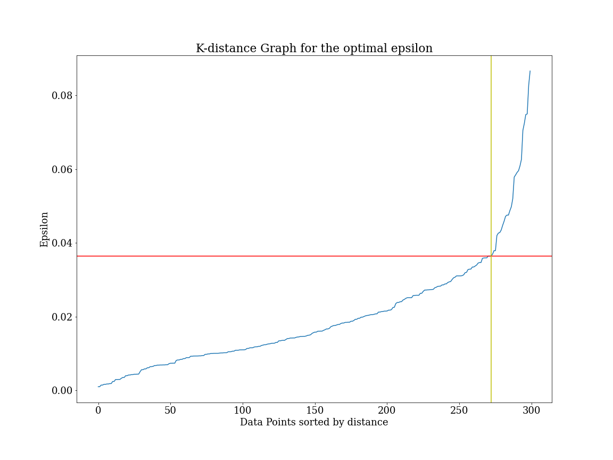

# Optimal-epsilon-value-for-DBSCAN-clustering-algorithm

The function presented determines the optimal value for epsilon in a DBSCAN  cluster algorithm using nearest neighbor approach with reading the knee point, then performing an DBSCAN clustering to determine the clusters in the data with the optimal epsilon value.

  

